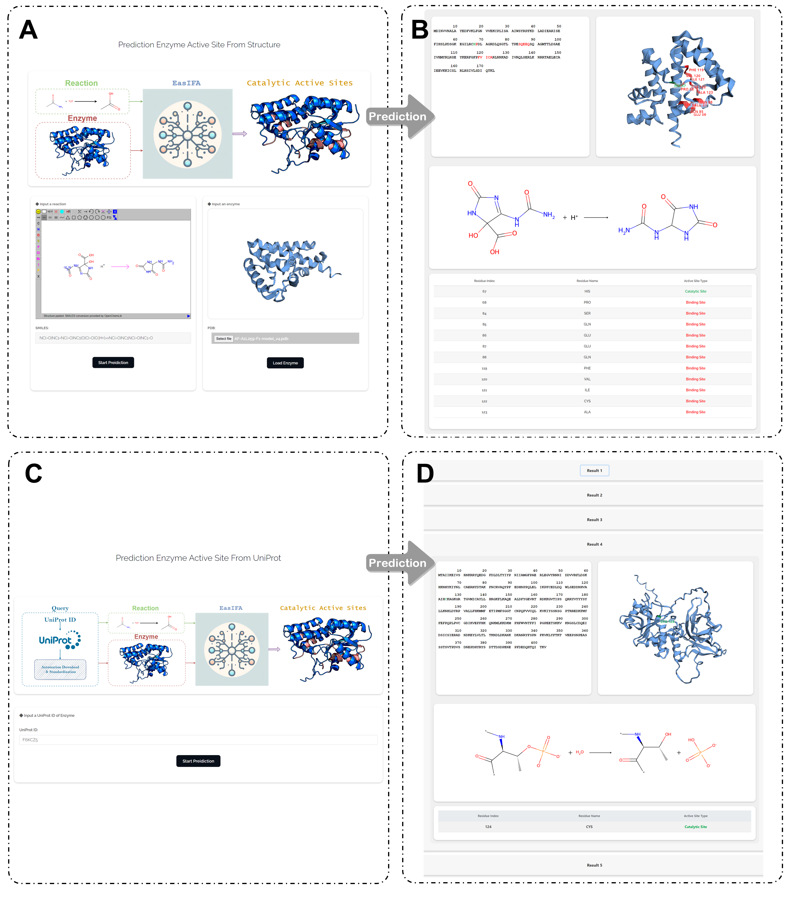

# EasIFA
  [](https://zenodo.org/doi/10.5281/zenodo.12819439)<br>
Implementation of enzyme catalytic acitve site prediction with EasIFA<br><br>

The high-definition images from the manuscript can be found at [`Manuscript Figures`](./paper_figures/).


## Contents

- [Publication](#publication)
- [Web Server](#web-server)
- [Quickly Start From Gitpod](#quickly-start-from-gitpod)
- [OS Requirements](#os-requirements)
- [Python Dependencies](#python-dependencies)
- [Installation Guide](#installation-guide)
- [Reproduce Results](#reproduce-results)
    - [Scoring Directly from the Downloaded Results Files](#1-scoring-directly-from-the-downloaded-results-files)
    - [Download Checkpoints and Dataset](#2-download-checkpoints-and-dataset)
    - [Test EasIFA](#3-test-easifa)

- [Cite Us](#cite-us)

## Publication
Multi-Modal Deep Learning Enables Ultrafast and Accurate Annotation of Enzymatic Active Sites

## Web Server

We have developed a [WebServer](http://easifa.iddd.group) for EasIFA, which allows you to conveniently annotate the active sites of enzymes you are interested in. The workflow is divided into two logical steps: [1)](http://easifa.iddd.group/from_structure) You can directly upload the PDB structure of the enzyme and the catalyzed reaction equation, [2)](http://easifa.iddd.group/from_uniprot) Provide the UniProt ID of the enzyme of interest directly.<br>



## Quickly Start From Gitpod
About 15 minutes for automated deployment. <br>
[](https://gitpod.io/github.com/wangxr0526/EasIFA) 


## OS Requirements
This repository has been tested on **Linux**  operating systems.

## Python Dependencies
* Python (version >= 3.8) 
* PyTorch (version >= 1.12.1) 
* RDKit (version >= 2019)
* TorchDrug (version == 0.2.1)
* fair-esm (version == 2.0.1)
* Py3Dmol (version ==2.0.3)

## Installation Guide
Create a virtual environment to run the code of EasIFA.<br>
It is recommended to use conda to manage the virtual environment.The installation method for conda can be found [here](https://conda.io/projects/conda/en/stable/user-guide/install/linux.html#installing-on-linux).<br>
Make sure to install pytorch with the cuda version that fits your device.<br>
This process usually takes few munites to complete.<br>
```
git clone https://github.com/wangxr0526/EasIFA.git
cd EasIFA
conda env create -f envs.yml
conda activate easifa_env
```


## Reproduce Results
### **[1]** Scoring Directly from the Downloaded Results Files
Open the Jupyter notebook file [`script/scoring_results.ipynb`](script/scoring_results.ipynb), follow the links within to download the result files and place them in the corresponding paths. Run the cells sequentially to obtain the results reported in the paper.

### **[2]** Download Checkpoints and Dataset

Running the following command can download the model's checkpoints and datasets (including the PDB structures in the dataset).

```
python download_data.py
```
The links correspond to the paths of the zip files as follows:
```
https://drive.google.com/uc?id=1ra11M4PpIalKx9ZZP-mrgj13IuFakjz3    --->    checkpoints.zip  (14Gb)
https://drive.google.com/uc?id=15c-KoZ47TpF9_qyQfJiY67gcgVZ8N5WR    --->    dataset.zip      
```

### **[3]** Test EasIFA
Test in the SwissProt E-RXN ASA dataset:

Active site position prediction task:

EasIFA-ESM-bin:
```
python main_test.py --gpu CUDA_ID \
                    --task_type active-site-position-prediction \
                    --dataset_path dataset/ec_site_dataset/uniprot_ecreact_cluster_split_merge_dataset_limit_100 \
                    --checkpoint checkpoints/enzyme_site_predition_model/train_in_uniprot_ecreact_cluster_split_merge_dataset_limit_100_at_2024-05-24-02-53-35/global_step_92000
```
EasIFA-SaProt-bin:

```
python main_test_saprot.py --gpu CUDA_ID \
                    --task_type active-site-position-prediction \
                    --dataset_path dataset/ec_site_dataset/uniprot_ecreact_cluster_split_merge_dataset_limit_100 \
                    --checkpoint checkpoints/enzyme_site_prediction_saprod_embding_model/train_in_uniprot_ecreact_cluster_split_merge_dataset_limit_100_at_2024-05-16-10-25-16/global_step_14000
```
EasIFA-NG-bin:
```
python main_test.py --gpu CUDA_ID \
                    --task_type ablation-experiment-3 \
                    --dataset_path dataset/ec_site_dataset/uniprot_ecreact_cluster_split_merge_dataset_limit_100 \
                    --checkpoint checkpoints/enzyme_site_no_gearnet_prediction_model/train_in_uniprot_ecreact_cluster_split_merge_dataset_limit_100_at_2024-05-20-05-13-33/global_step_24000
```

Active site categorie prediction task

EasIFA-ESM-multi:
```
python main_test.py --gpu CUDA_ID \
                    --task_type active-site-categorie-prediction \
                    --dataset_path dataset/ec_site_dataset/uniprot_ecreact_cluster_split_merge_dataset_limit_100 \
                    --checkpoint checkpoints/enzyme_site_type_predition_model/train_in_uniprot_ecreact_cluster_split_merge_dataset_limit_100_at_2024-05-26-02-48-38/global_step_86000
```
EasIFA-SaProt-multi:
```
python main_test_saprot.py --gpu CUDA_ID \
                    --task_type active-site-categorie-prediction \
                    --dataset_path dataset/ec_site_dataset/uniprot_ecreact_cluster_split_merge_dataset_limit_100 \
                    --checkpoint checkpoints/enzyme_site_type_prediction_saprod_embding_model/train_in_uniprot_ecreact_cluster_split_merge_dataset_limit_100_at_2024-05-19-20-00-00/global_step_72000
```
Test in the MCSA E-RXN CSA dataset:

EasIFA-ESM-bin
```
python test_knowledge_transfer_learning.py --gpu CUDA_ID \
                                            --dataset_path dataset/mcsa_fine_tune/normal_mcsa \
                                            --structure_path dataset/mcsa_fine_tune/structures \
                                            --checkpoint checkpoints/enzyme_site_predition_model_finetune_with_mcsa/train_in_normal_mcsa_at_2023-10-06-09-48-04/global_step_37200
```
EasIFA-SaProt-bin
```
python test_knowledge_transfer_learning.py --gpu CUDA_ID \
                                            --dataset_path dataset/mcsa_fine_tune/normal_mcsa \
                                            --structure_path dataset/mcsa_fine_tune/structures \
                                            --checkpoint checkpoints/enzyme_site_predition_saprot_embding_model_finetune_with_mcsa/train_in_normal_mcsa_at_2024-05-23-08-05-31/global_step_19400 \
                                            --use_saprot
```
## Cite Us

Under review
